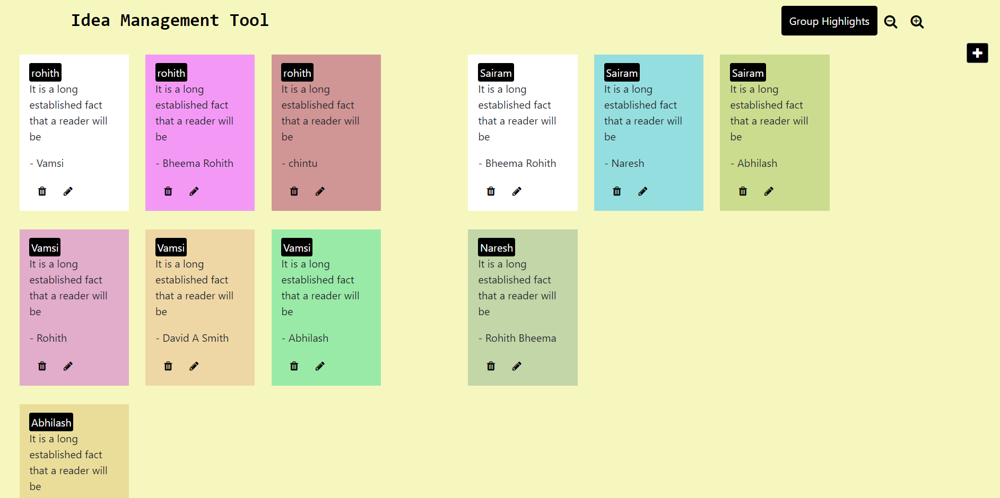
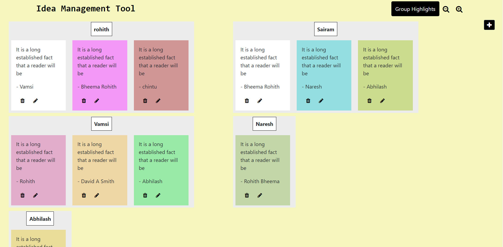
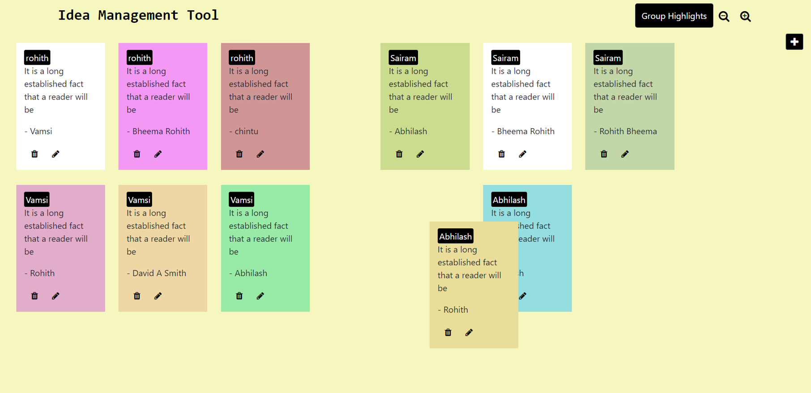
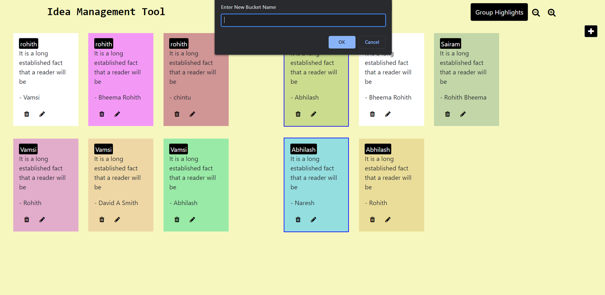
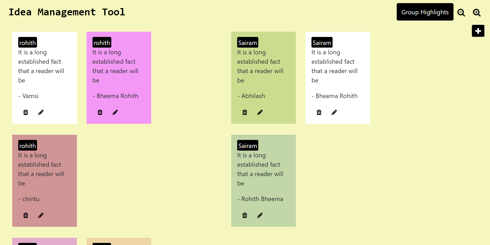

# Idea-Management-Tool
Idea management is a practice used to organize insights. It allows large numbers of sticky notes (aka highlights) to be freely combined and sorted into clusters (aka groups) based on their natural relationships. 
Checkout the video demo <a href="#"> Here</a>

Notes without grouping based on similar buckets.

 

Grouping them based on similar buckets.

 

Draging them to change buckets.

 

By clicking Ctrl + selecting the notes and then enter we can create the new buckets.

 

By clicking on zoom in button we can zoom in the page similarrly we can zoom out them.
 

### Link To Website
Checkout the Website <a href="https://idea-management-tool-rohith.herokuapp.com/">here</a>

#### Instructions & Features

- Add/Remove/Edit highlights
- Create buckets to group highlights in
- Group highlights into buckets
- Move highlights from one bucket to another.
- Zoom in/Zoom out of the whiteboard, resizing the Idea management tool components themselves.

#### Setting up Locally
- First clone the repo by using git clone link...
- Then do npm install to install all the dependencies.
- Then start the server by using npm start.
- Then we can see the website at localhost:3000 
